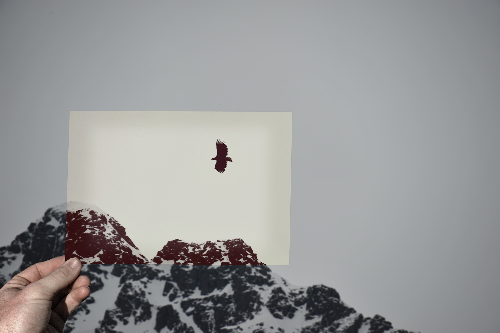
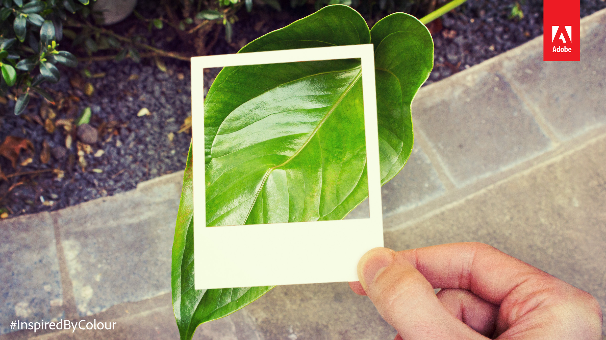

# Dear Photoshop

> Photoshoping mise en abyme

## What

Inspired from [Dear Photograph](http://dearphotograph.com/) website creation, this tool aims to automate
the process.

## How

_This script/project is originaly build for **Adobe Photoshop CS6**._

* You need a good picture (a photography)
* You need a pic of a hand (this is the hard point)
* [Download the script](https://raw.githubusercontent.com/LeoColomb/DearPhotoshop/master/src/DearPhotoshop.atn) and import it in Photoshop
* Open the original photography and make a selection where the _mise en abime_ will be inserted
* Execute the script
* Import and place the hand
* Wouaouh!

## TO-DO

The final script may automate the way to create this view.

## License

Project licensed under the [MIT License](LICENSE).  
Converter scripts are licensed under the [BSD License](http://ps-scripts.cvs.sourceforge.net/viewvc/ps-scripts/xtools/LICENSE) by xbytor.
